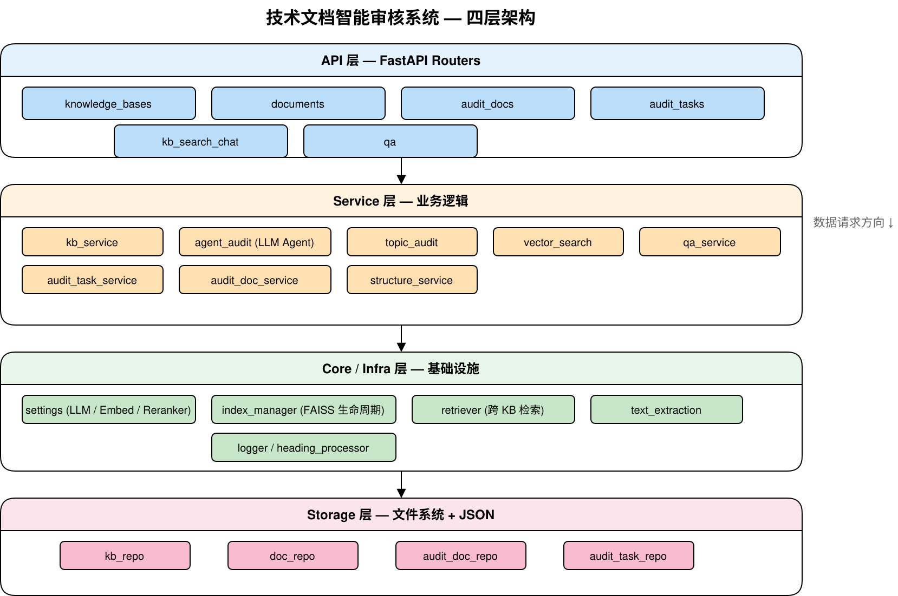
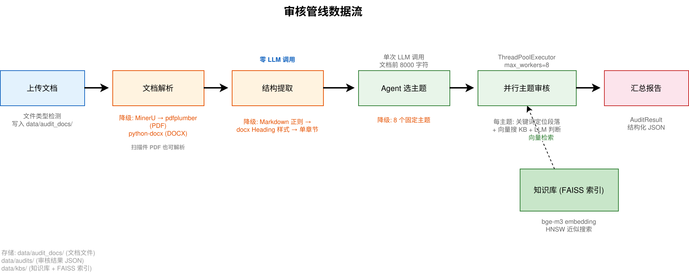
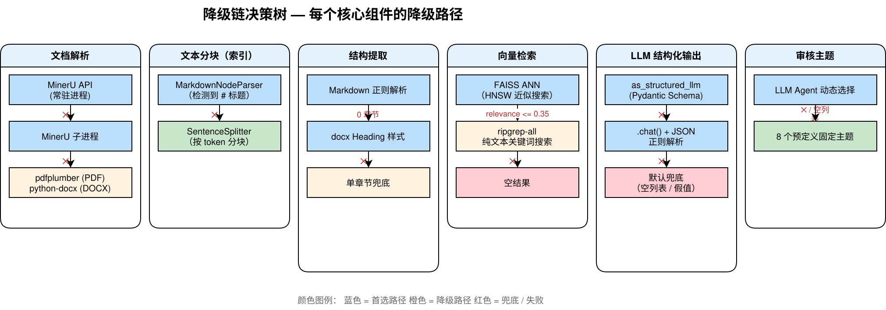
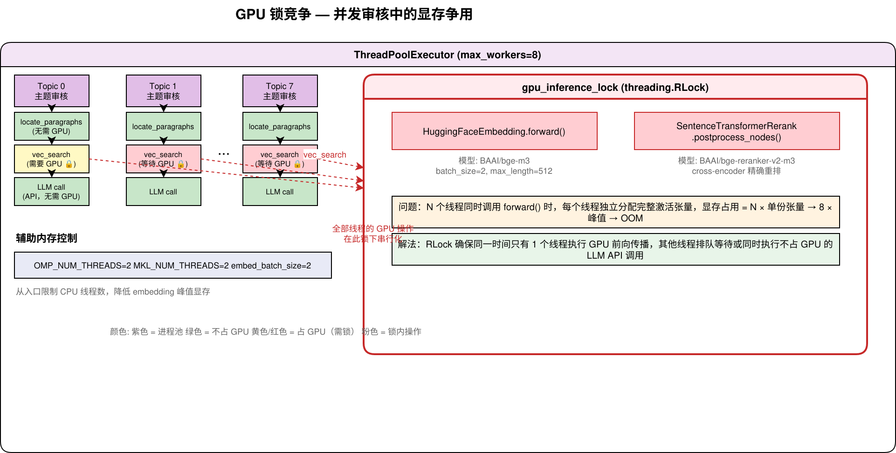

# 复盘 #1：技术文档审核系统架构全貌与已知债务

## 1. 项目背景与目标

技术文档智能审核系统旨在解决企业招投标场景中的文档审核问题。招标文件、技术规格书等文档通常长达数百页，需要对照国家标准、行业规范、企业内部制度进行逐条审查，涉及税率合规、品牌限制、质保条款、违约责任等多个维度。纯人工审核耗时费力，且容易遗漏。

系统定位为一项辅助工具：用户上传待审核的技术文档，系统通过知识库（预置的标准/规范文档集合）进行对比分析，输出结构化审核报告，列出潜在问题及其严重程度、标准依据和修改建议。

本文的目标读者是 AI/LLM 应用开发者。项目尚处于开发探索阶段，尚未正式投入使用。文中将完整呈现当前架构设计、各模块的降级策略，以及已知的不足之处，期待获得反馈和改进建议。

### 技术栈概览

| 组件           | 技术选型                                      |
| ------------ | ----------------------------------------- |
| 后端框架         | FastAPI（Python 3.12）                      |
| 向量检索引擎       | LlamaIndex + FAISS（HNSW）                  |
| Embedding 模型 | BAAI/bge-m3                               |
| LLM 推理       | Ollama / MiniMax / OpenAI / DeepSeek（可切换） |
| 文档解析         | MinerU → pdfplumber / python-docx         |
| 前端           | React + TypeScript + Vite + Tailwind CSS  |
| 数据存储         | 文件系统 + JSON 元数据                           |
| 包管理          | uv                                        |

## 2. 整体架构

系统采用四层架构，自上而下分别为 API 层、Service 层、Core/Infra 层和 Storage 层。

**图 1：四层架构总图**




**API 层** 包含六个路由模块，覆盖知识库管理、文档管理、审核文档管理、审核任务、知识库搜索聊天以及问答功能。所有路由定义在 `api/routers/` 目录下。

**Service 层** 封装业务逻辑。这里存在两个独立的文档域：知识库文档（`KBDocument`）和待审核文档（`AuditDocument`），二者的生命周期和存储位置互不干扰。

**Core/Infra 层** 提供基础设施能力——LLM 和 Embedding 模型的统一管理、向量索引的加载与缓存、文本提取引擎的封装。这是项目的"技术底座"。

**Storage 层** 采用文件系统加 JSON 文件的持久化方案（无外部数据库依赖）。这一选择源于项目初期简化实现的需要，当前已形成一定规模的技术债，将在第 6 节详细讨论。

## 3. 核心流程：审核管线

审核管线是系统的价值核心，涵盖从文档上传到生成审核报告的完整链路。

**图 2：审核管线数据流**




### 3.1 文档上传与解析

用户上传 PDF 或 DOCX 文件后，系统首先检测文件类型，将文件写入 `data/audit_docs/` 目录，然后调用解析引擎提取纯文本。

解析引擎有三层降级：优先使用 MinerU（支持扫描件 PDF 和 DOCX 的深度解析，保留表格和层级结构）；MinerU 不可用时，PDF 文件降级到 pdfplumber；DOCX 文件降级到 python-docx。

### 3.2 文档结构提取

结构提取模块从纯文本中识别章节层级，生成 `DocumentStructure` 对象，包含章节（Chapter）和条款（Clause）两级结构。整个提取过程**不调用 LLM**，完全依靠正则表达式和文档样式信息。

降级链为：Markdown 标题正则解析 → docx 原生 Heading 样式解析 → 整篇文档作为单章节兜底。

### 3.3 Agent 审核主题选择

系统读取文档前 8000 个字符，交给 LLM 分析，要求其判断文档类型并自主决定需要审核哪些维度。

LLM 参考 8 个预定义的审核维度（增值税与税率合规、品牌限制与公平竞争、费用与支付条款、质保与验收要求、责任与违约条款、采购范围与技术要求、数据与指标合理性、文档完整性），可以选择其中的子集，也可以自定义新的维度。输出使用 LlamaIndex 的 `as_structured_llm` + Pydantic Schema，确保返回结构化的主题列表。

这是一个单次 LLM 调用，没有迭代或者精炼过程。如果 LLM 调用失败（结构化输出或降级的 JSON 解析均失败），则直接使用全部 8 个预定义主题以确保审核能够进行。

### 3.4 主题审核

对每个审核主题执行以下三步：

1. **段落定位**：用预定义关键词在全文搜索相关段落，取关键词前后各 1500 字符作为上下文
2. **知识库检索**：用关键词在指定知识库中做向量搜索，获取标准/规范中相关的条款作为参考依据
3. **LLM 判断**：将文档段落与知识库参考依据一并提交给 LLM，要求其判断是否存在违规、遗漏或不一致之处

每个主题执行一次 LLM 调用。各主题之间无依赖关系，通过 `ThreadPoolExecutor` 并行执行（最大 8 个并发），每个主题完成后立即更新任务进度。

### 3.5 输出结构化审核报告

所有主题审核完成后，系统汇总结果生成 `AuditResult`，包含：

- 问题数量按类型（合规/compliance、完整性/completeness、一致性/consistency）和严重级别（high/medium/low）的分类统计
- 每个问题的详细描述、位置、严重级别、标准引用和修改建议
- 审核过程的原始分析文本

报告使用 Pydantic 模型定义，以结构化 JSON 形式存储在文件中。

## 4. 降级链设计

AI 系统具有天然的不确定性——LLM 可能超时、结构化输出可能解析失败、向量检索可能召回不到相关内容。因此系统中的每个关键组件都设计了降级路径。将这些降级策略汇总在一起，可以比较清晰地看到系统的鲁棒性来源。

**图 3：降级链决策树**




1. **每层降级不阻断流程**。即使某一步完全失败，后续步骤仍能执行（可能以较低质量运行），而不是抛出异常终止整个管线。
2. **降级路径的输出格式与主路径保持一致**。例如，`_text_search_fallback()` 返回的文本格式与 `_format_kb_results()` 保持一致，使得下游的 LLM 调用无需区分数据来源。

## 5. 并发控制与 GPU 资源管理

系统采用线程级别的并发（`concurrent.futures.ThreadPoolExecutor`），而非进程或异步任务队列，这带来了一些显存管理上的挑战。

**图 4：GPU 锁竞争示意**




问题源于 HuggingFace Embedding 模型和 Reranker 的 forward 方法非线程安全：多个线程同时进行前向传播时，每个线程会独立分配完整的激活张量，在最大并发数（8）下很容易撑爆显存。

解决方案是一个全局的 `threading.RLock`（`gpu_inference_lock`）。所有 GPU 操作（Embedding 推理、Reranker 推理）在执行前必须先获取该锁。Embedding 模型本身使用双重检查锁定模式（double-checked locking）实现延迟加载，确保在并发环境下只加载一次。

由于 LLM 调用走 API（Ollama 本地 HTTP API 或 MiniMax/OpenAI/DeepSeek 云端 API），不占用 GPU，因此线程在等待 GPU 锁时，LLM 调用仍可正常进行。系统中还设置了 `OMP_NUM_THREADS=2` 和 `MKL_NUM_THREADS=2` 环境变量，从入口限制 CPU 线程数以减少内存峰值。

## 6. 已知的坑与技术债

本节列出项目中已知但尚未修复的问题，以供参考和批评。

### 6.1 文件系统存储

系统目前使用 JSON 文件存储所有数据（知识库元数据、文档元数据、审核任务、审核结果等）。虽然没有外部数据库依赖简化了部署，但在实际使用中已经暴露了若干问题：

- 按 ID 查找审核任务时需要遍历 `data/audits/*/tasks/` 目录下的所有 JSON 文件（`audit_task_repo._locate_task()`），随着任务数量增长，性能会线性下降
- 写操作通过 `threading.Lock` 保护，没有事务保证，并发写入时可能出现数据不一致
- 缺乏数据完整性约束——无法确保引用的知识库 ID 或文档 ID 确实存在

这一选择源于项目早期对简化实现的需求，尚未进行数据库迁移。

### 6.2 异步审核的实现方式

审核任务的异步执行使用 `threading.Thread(daemon=True)` 实现。Daemon 线程在服务重启时被强制终止，可能导致正在处理中的审核任务永远停留在 "processing" 状态。系统在 FastAPI 启动时有一段恢复逻辑（重置卡住的任务状态），但这是一种事后补偿而非预防机制。

没有采用 Celery、Redis Queue 或正式的异步任务队列方案。

### 6.3 向量搜索降级阈值

在 `search_by_keywords()` 中，判断是否接受向量搜索结果时使用的阈值为 0.35：

```python
if results and any(r.get("relevance", 0) > 0.35 for r in results):
    return _format_kb_results(results)
return _text_search_fallback(...)
```

该阈值并未经过系统的 benchmark 校准。项目包含一个完整的检索评测模块（`benchmark/`），可以计算 nDCG、MRR 等指标，但目前尚未将评测结果反哺到阈值配置中。

### 6.4 Agent 主题选择的信息截断

`agent_audit.determine_audit_topics()` 只向 LLM 提供文档前 8000 个字符用于判断审核主题。对于数百页的招标文件来说，后半部分的特殊条款、附件、变更说明可能完全不在这 8000 字符内。这一截断是否在实践中导致主题遗漏——尚未经过验证。

### 6.5 其他未验证的设计假设

- 并行审核时是否存在主题间的输出冲突？当前设计假设每个主题独立审核，但如果两个主题针对同一段落给出不同判断，目前没有去重或仲裁机制
- 关键词定位段落（`locate_paragraphs`）固定取前后 1500 字符，没有根据文档类型或段落长度做自适应调整
- 测试覆盖不完整——核心的审核逻辑（`topic_audit.audit_topic()`）缺乏针对 LLM 输出变化的测试用例
