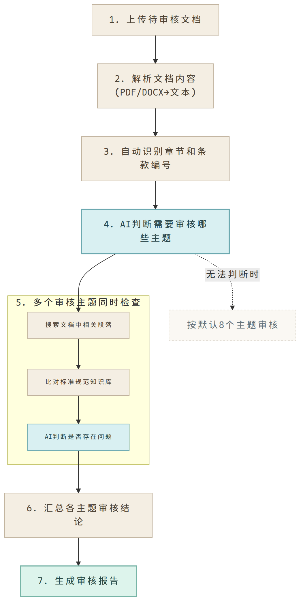
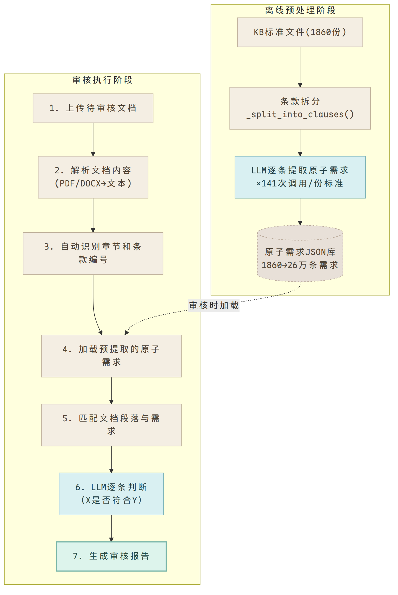
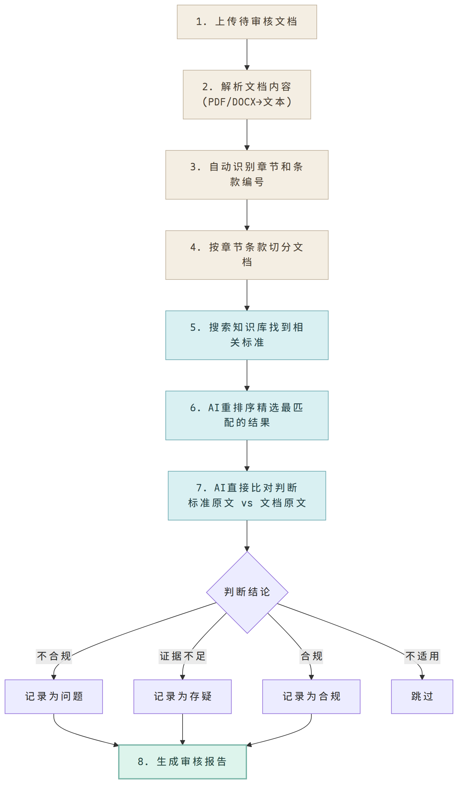

# 复盘 #2：一次技术决策的三次迭代

> 这是一篇开发日记，记录了 2026 年 6 月 23 日的一次架构决策过程，仅用于日后复盘参考，并非正式的技术博客。
>
> 上一篇（复盘 #1）介绍了技术文档审核系统的整体架构，描述了初版的设计方案：按 8 个预定义审核主题，每个主题独立调用 LLM 进行审核判断。
>
> 在那篇文章写成的时候，我们对架构的走向还比较乐观。但随后的实践让我们意识到，初版方案存在一些根本性的问题。本文记录的是接下来发生的故事——一次架构决策的三次迭代，以及每次迭代背后的思考与权衡。

## 问题的本质

复盘 #1 中描述的核心思路是"主题审核"：把标准规范中的要求归纳成 8 个审核主题，每个主题配一组关键词，在文档中定位相关段落，提交 LLM 判断。

这个方案看起来可行，但实际使用中暴露了两个问题。

第一个问题是覆盖面。8 个主题是根据经验总结的，但标准规范覆盖了十几个专业领域，每个领域有各自的技术要求。如果某个主题没有被预先定义，那个领域的问题就会被系统忽略。这是一个典型的"你只能找到你正在找的东西"的问题。

第二个问题是 LLM 的调用方式。每次审核调用中，LLM 身兼四职：定位相关段落、搜索对应标准、比对判断差异、输出结构化结论。多个任务挤在一次调用中，LLM 的输出质量难以稳定控制。同一个文档在不同次运行中可能给出不同的结论，这在审核场景中是不可接受的。

> 图：方案一的审核流程。8 个预定义主题各自独立执行关键词定位、向量搜索和 LLM 判断。

## 第一次迭代：按主题审核 → 原子需求提取

针对"覆盖面"的问题，我们想到的改进方向是：把决定权从人工定义转移到标准本身。既然知识库里已经有完整的标准规范，为什么不直接基于标准条款来驱动审核？

方案是把知识库中的每一条标准条款拆成最小可检查的需求单元。例如，标准原文"质保期自验收合格之日起计算，不得少于 12 个月"拆成两条需求：①起算点应为验收合格之日，②质保期不少于 12 个月。每条需求携带关键词、检查类型（阈值判断/存在性判断/精确匹配/语义判断）和标准引用信息。

这个思路在逻辑上更精确。审核流程变成：加载需求 → 匹配文档段落 → 逐条判断。LLM 的任务从"找问题"降级为二元判断"文档所述是否满足此要求"，理论上输出更可靠。

在投入完整实现之前，我们做了一次成本估算。1860 份标准规范，平均每份可拆出约 140 条真实条款，每条需要一次 LLM 调用来提取。按每份 0.08 美元的 API 成本估算，全部提取需要近 150 美元。时间成本更不容乐观：单份标准提取约 12 分钟，1860 份不间断运行需要 26 天。

> 图：方案二的审核流程。离线预处理阶段需要逐条 LLM 提取原子需求，成本过高。

即使忍受了初期的提取成本，后续还有维护负担——技术标准持续更新，每次更新都需要重新提取。

这个方案被搁置了。但它留下了一个有价值的结论：**审核粒度应该从主题级细化到条款级，但不能通过逐条提取来实现。**

## 转折：一个海外案例的启发

在寻找替代方案的过程中，我们读到了一篇关于合同审核 RAG 系统的技术分析（FutureAGI, 2026）。这个系统解决的是类似问题：用 AI 对比商业合同条款与企业内部的法务标准条款（playbook）。

它的架构有一个关键差异：**不做需求提取。** 标准条款的原文就是需求。审核时，系统同时从向量数据库检索出合同条款和对应的 playbook 条款，在一次 LLM 调用中直接比对。

这个思路点醒了一个之前被忽略的前提假设：LLM 完全有能力直接阅读标准原文来判断合规性。我们一直在想"怎么把标准提炼给 LLM"，但 LLM 不需要提炼——它读得懂原文。真正需要解决的不是"如何表达需求"，而是"如何在审核时定位到正确的标准条款"。

## 第二次迭代：需求提取 → FAISS 直接比对

> 图：方案三的审核流程。无预处理成本，标准原文即需求，FAISS 搜索结果可追溯至具体条款。

最终方案放弃了"提取"这个中间步骤，回归到检索本身。

标准规范文件直接按条款分块，在索引阶段写入 FAISS。与常规向量搜索不同的是，每个索引块除了文本内容，还携带了条款编号和章节路径作为元数据。这样搜索返回的结果不再是"某份文件的某一段落"，而是"标准 CJJ101-2016 第 3.2.1 条"——可追溯到具体条款。

审核流程简化为三步：

1. 将待审核文档按章节条款分块
2. 对每个文档块执行 FAISS 搜索，定位最相关的 3-5 条标准条款
3. 把文档块和标准条款原文一起发给 LLM，做合规比对

与第一次"原子需求提取"方案的核心区别在于：**审核时搜索到多少标准条款，就调用多少次 LLM。** 没有离线预处理成本，标准库更新时不需要重新提取任何东西——索引即知识，更新即用。

以下是对三次方案的实际成本和效果对比：

| 维度 | 主题审核（初版） | 原子需求提取（v2） | FAISS 直接比对（现版） |
|------|---------------|----------------|-------------------|
| 预处理 1860 份标准 | 不需要 | LLM 调用约 26 万次，预估 26 天 | 不需要 |
| 审核 1 份文档的 LLM 调用量 | 8 次 | 约 200 次（含需求匹配） | 约 20 次 |
| 单次审核 API 成本 | 约 2 美分 | 约 3 美分 | 约 0.3 美分 |
| 结论可追溯性 | 追溯审核主题 | 追溯标准条款 | 追溯标准条款 |
| 标准更新维护 | 无影响 | 需重新提取受影响的标准 | 无影响 |

> **说明：** 上述成本数据基于单份标准文件（CJJ101-2016）的实测推算，尚未经过全部 1860 份标准和真实业务文档的大规模验证。实际部署时，FAISS 搜索的召回率、LLM 判断的准确率、以及不同专业领域下的表现，还需要进一步测试和校准。

## 几个值得记住的认知

这次决策过程经历了三次迭代才找到正确的方向，回头看在前提假设上犯了三次错误。

第一次是误以为"审核主题"是一个有效的抽象层次。主题是人为构造的概念，而标准规范中的要求是具体的、可逐条检查的。用抽象去覆盖具体，结果必然是覆盖不全。

第二次是误以为"结构化提取"是必要的前置步骤。这是一个更隐蔽的思维定势：先提取知识，再应用知识。在 LLM 能力有限的时代，这是正确做法；但当 LLM 能直接理解原文时，中间的提取层就变成了纯成本，不创造价值。核心判断标准很简单：**提取的结果是否被多次复用？** 如果是单次使用，就应该在需要时即时生成。

第三次是低估了"索引元数据"的价值。过去做向量搜索时，我们只索引文档级别的元数据（文档 ID、文件名）。加入条款编号和章节路径后，搜索返回的信息质量明显提升——LLM 收到的上下文从"某份文件的一段内容"变成了"标准 CJJ101-2016 第 3.2.1 条"。这个改进不需要换模型，不需要调参，只需要在索引时多存几个字段。

这些认知可能不适用于所有 RAG 场景，但对于"文档逐条比对"这类任务，应该是有参考价值的——至少能帮你少走一次弯路。

## 后续计划

本文讨论的第三次方案（FAISS 直接比对）已经完成核心代码开发和单文件验证，但距离实际可用还需要完成以下工作：

1. **批量导入标准库** — 将 1860 份标准规范文件导入知识库，重建向量索引。这是一个一次性任务，索引建立后即可用于审核。
2. **用真实文档验证** — 拿实际的技术文档跑一遍审核流程，人工检查产出质量，发现问题和漏报，迭代优化 prompt 和检索参数。
3. **补充专业知识** — 标准条款可以检查合规性，但还有很多工程知识不在标准文本中（比如某种设计是否合理、某个参数是否留有足够余量）。这部分如何覆盖，是下一步需要解决的问题。

---

*下一篇（复盘 #3）计划讨论专业性审核（合理性问题），即标准规范之外的经验性判断，这是一个尚未解决的难点。*
