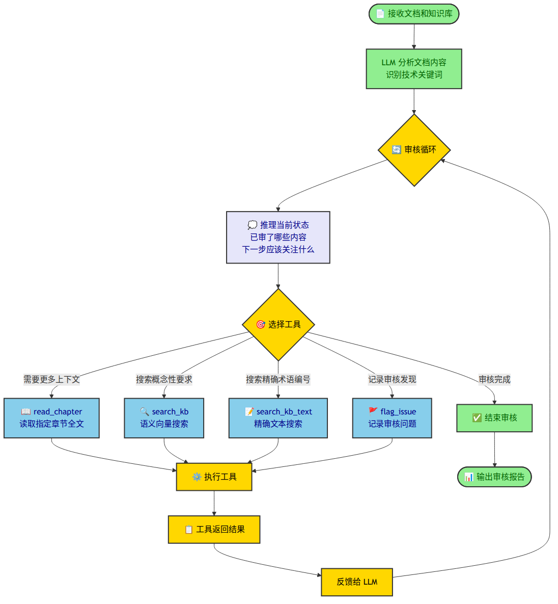

# 复盘 #3：从预设流程到自主代理

> 上一篇（复盘 #2）记录了三次架构迭代——从固定主题审核到 FAISS 直接比对。回头看，这三次迭代有一个共同的特征：审核流程由人预先定义，LLM 在预设的步骤中执行判断。今天尝试了另一种思路——让 LLM 像真人审核一样，自己决定每一步做什么。

## 预设流程：人定义步骤，LLM 执行

复盘 #1 和复盘 #2 中的所有方案都属于同一种模式：由人来设计审核流程，将任务拆解为固定的步骤，LLM 在每个步骤中执行指定的操作。

这个项目从 RAG 起步。RAG 的标准流程是检索 → 增强 → 生成，这个流程很自然地延续到了审核场景：关键词定位段落 → 向量搜索标准 → LLM 判断合规性。每一步做什么、输入什么、输出什么，都由代码预先规定。

三次架构迭代——主题审核、原子需求提取、FAISS 直接比对——都没有跳出这个模式。它们改进了步骤内部的做法（换关键词、换分块策略、换搜索方式），但"由人定义步骤、LLM 执行步骤"这个基本结构没有改变。

这种模式的优势是可控。流程确定，成本大致确定，每一步的输出格式确定。局限也很明显：审核的质量上限由设计者定义的步骤决定。步骤没覆盖的方向不会被执行，步骤之间没有动态调整的空间。

## 自主代理：让 LLM 自己搜

预设流程中，知识库搜索是由程序调用的。程序调用一次向量搜索，把返回结果拼进 prompt 给 LLM，LLM 基于这批结果做判断。这套流程的问题是：如果搜索结果不好——搜到的标准不相关、关键条款没命中——LLM 没有任何办法补救。它只能基于手里这批不相关的标准做判断，输出一份在形式上完整但实质上无效的报告。

这就是 RAG 思维下的结构性问题：知识库搜索的主动权在程序手里，不在 LLM 手里。程序调一次，LLM 用一次。没有迭代，没有反馈，没有调整。

Agentic 方式做的事很简单：把搜索工具直接交给 LLM。LLM 读完文档后，自己决定用什么关键词搜、用语义搜索还是精确文本搜索、搜索结果不好就换关键词换角度再搜。搜索不再是程序执行一次然后交给 LLM 的"外部输入"，而是 LLM 在审核过程中反复调用的"自己的工具"。

实现上就是写了一个 agent loop，让LLM在loop中自己推理和调用工具：

LLM 进入loop循环后，每轮做四件事：推理当前进展和下一步方向、选择一个工具调用、获取工具返回的结果、根据结果更新自己的判断。循环终止的条件是 LLM 自己决定"审核已经充分"——不再调用工具而是给出最终结论。

具体实现选了 DeepSeek 原生 function calling 作为主路径，支持 thinking 模式让模型在调用工具前做显式推理。

四个工具的设计：

- `read_chapter` — 长文档初始只给前 8000 字，需要时按需加载后续章节
- `search_kb` — 语义向量搜索知识库，适合搜索概念性要求，能匹配同义词
- `search_kb_text` — 精确文本搜索（底层是 ripgrep-all），适合搜标准编号（GB/T 12345）和参数值（IP65），补语义搜索的盲区
- `flag_issue` — 调用工具来记录发现的问题，保证每条问题格式统一，后续处理和统计不需要额外解析

前三个负责"获取信息"，最后一个负责"记录结论"。LLM 在运行中自己组合它们。

例如今天的一次测试中，Agent 搜了 11 轮、调了 25 次工具。它先用 `search_kb` 搜"IEC 防护等级""电磁兼容"等概念，相关度太低；换 `search_kb_text` 精确搜文档中引用的标准编号（GB 50063、GB/T 18858），仍未命中。确认知识库不匹配后，它放弃外部标准比对，转而发现了文档内部的回路编号错乱问题。整个过程没有人告诉它该搜什么、搜不到该换什么、什么时候该换方向——这是 LLM 自己根据每一步的反馈做出的决策。
