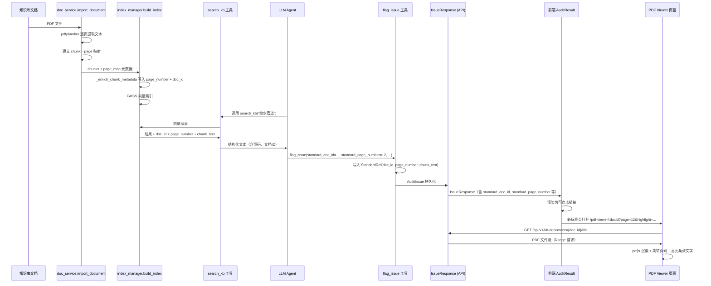

# 审核结果标准依据 PDF 跳转定位 — 设计文档

**日期:** 2026-06-26  
**状态:** 待审核  
**目标:** 审核结果中的标准依据可点击，跳转到 PDF 预览并定位到条款所在页面，高亮条款文字

---

## 一、需求概述

用户在审核结果的 issue 卡片中看到标准依据（如「GB/T 12345-2020 § 3.2.1」），点击后在新标签页中打开该标准文档的 PDF 预览，自动定位到条款所在页码，并高亮条款文字。

### 设计决策汇总

| 维度 | 决策 |
|------|------|
| 定位精度 | 条款级 — 跳到页面 + 高亮条款文字 |
| 文档溯源 | flag_issue 时 LLM 记录 doc_id、page_number、chunk_text |
| 页码获取 | 索引时存入 chunk metadata（老文档需重建索引） |
| 交互形式 | 新标签页打开 PDF 预览页面 |
| 格式支持 | PDF 完整预览+高亮；DOCX/MD 纯文本降级 |

---

## 二、数据模型改造

### 2.1 StandardRef（models/audit_task.py）

新增 3 个字段用于溯源定位：

```python
class StandardRef(BaseModel):
    standard_name: str
    standard_id: str
    clause: str | None
    requirement: str | None
    # 新增 ——
    doc_id: str | None          # KB 文档 ID，用于定位文件
    page_number: int | None     # 条款所在页码
    chunk_text: str | None      # 该 chunk 的原文片段，用于 PDF 高亮搜索
```

### 2.2 AgentAction（models/llm_schemas.py）

flag_issue 工具参数新增：

```python
standard_doc_id: str | None         # 从 search_kb 结果中选择的文档 ID
standard_page_number: int | None    # 条款所在页码
standard_chunk_text: str | None     # chunk 原文（用于高亮定位）
```

### 2.3 IssueResponse（api/routers/audit_tasks.py）

补齐丢失字段 + 新增溯源字段：

```python
class IssueResponse(BaseModel):
    # ... 现有字段（id, type, clause_number, description, severity,
    #               standard_name, standard_clause, suggestion）...
    # 补齐 ——
    cited_excerpt: str | None
    document_position: str | None
    # 新增 ——
    standard_doc_id: str | None
    standard_page_number: int | None
    standard_chunk_text: str | None
    standard_file_type: str | None  # pdf / docx / md，前端据此决定渲染方式
```

> **实现注意：** `standard_file_type` 不存储在 `AuditIssue` 中，而是在构建 `IssueResponse` 时根据 `standard_doc_id` 从 doc_repo 查询文档的 `file_type` 动态填充。若查询失败则保持 `None`，前端只用 `standard_name` 文本展示。
```

---

## 三、索引元数据增强（页码注入）

### 3.1 import 阶段：page→chunk 映射

**文件:** `services/doc_service.py`

在 `import_document()` 解析 PDF 时（pdfplumber 路径），改为逐页提取文本，保持页边界与 chunk 的对应关系。每页作为一个或两个 chunk，确保 chunk 和页码的对应是天然的。

非 PDF 格式（docx/md）使用虚拟页码（按字符数约 3000 字一页估算），因为纯文本降级模式不需要精确页码。

### 3.2 index 阶段：页码写入节点 metadata

**文件:** `core/index_manager.py`

在 `_enrich_chunk_metadata()` 函数中新增：

```python
# 从文档 metadata 中读取 page_map (chunk_index → page_number)
# 写入 node metadata:
#   page_number: int — 页码
#   doc_id: str     — 所属文档 ID
```

### 3.3 已有文档索引重建

提供 CLI 命令：

```bash
uv run python -m cli kb reindex --kb-id <id>     # 全库重建
uv run python -m cli kb reindex --doc-id <id>    # 单文档重建
```

逻辑：清空 FAISS 索引 → 重新 import（拿页码） → 重新 index。

---

## 四、search_kb 工具增强 + flag_issue 溯源记录

### 4.1 search_kb 工具返回增强

**文件:** `services/agentic_audit.py` — `_tool_search_kb()` 和 `_tool_search_kb_text()`

搜索结果改为返回结构化信息，每条结果包含：

| 字段 | 来源 | 说明 |
|------|------|------|
| `doc_id` | node.ref_doc_id | KB 文档 ID |
| `doc_name` | node metadata | 标准名称 |
| `clause_number` | node metadata | 条款号 |
| `page_number` | node metadata（新增） | 页码，可能为 None |
| `chunk_text` | node.text | 原文片段 |
| `relevance` | score | 相关性分数 |

工具返回给 LLM 的文本格式：

```
[搜索结果 1] 文档: CJJ101-2016 (doc_id: abc123)
条款: 3.2.1 | 页码: 第 12 页
内容: 给水管道应采用耐腐蚀材料...
相关性: 0.89
```

### 4.2 flag_issue 工具改造

**文件:** `services/agentic_audit.py` — `_tool_flag_issue()`

从 `AgentAction` 中读取新增的溯源字段，写入 `StandardRef`：

```python
standard_reference=StandardRef(
    # ... 现有字段 ...
    doc_id=action.standard_doc_id,
    page_number=action.standard_page_number,
    chunk_text=action.standard_chunk_text,
)
```

### 4.3 Agent 系统提示词更新

在系统提示词中告知 LLM：
- search_kb / search_kb_text 的每条结果包含 `doc_id`、`page_number` 信息
- flag_issue 时应携带对应的 `standard_doc_id`、`standard_page_number`、`standard_chunk_text`
- 这些字段为 optional，不强制填写（LLM 可能偶尔遗漏，不应阻塞审核）

---

## 五、新增 API 端点

### 5.1 PDF 文件服务端点

**文件:** `api/routers/kb_files.py`（新建）

```
GET /api/v1/kb-documents/{doc_id}/file
```

- 从 doc_repo 获取文档元数据，验证存在
- 读取 file_path 指向的文件
- 返回 `StreamingResponse`，Content-Type 按 file_type 设置：
  - pdf → `application/pdf`
  - docx → `application/vnd.openxmlformats-officedocument.wordprocessingml.document`
  - md → `text/markdown`
- **必须支持 Range 请求**（`Accept-Ranges: bytes`）— pdfjs 按 range 分片加载 PDF 页面，不支持 Range 则 pdfjs 无法按页跳转
- 安全校验：doc_id 存在且 file_path 在合法目录下，防止路径穿越

### 5.2 条款文本提取端点（文本降级用）

```
GET /api/v1/kb-documents/{doc_id}/page/{page_number}
```

- 仅对非 PDF 格式（docx/md）使用
- 从已解析的文档 chunks 中筛选对应页码的内容
- 返回格式：
  ```json
  {
    "page_number": 12,
    "text": "...",
    "total_pages": 45
  }
  ```

### 5.3 单文档元数据端点

```
GET /api/v1/kb-documents/{doc_id}
```

- PDF 查看器页面加载时需获取文档的 `file_type`、`name`、`page_count` 等元数据
- 现有 API 没有按 doc_id 单独查询的端点（只有按 kb_id 列表查询）
- 返回 `KBDocument` 的核心字段：`id`, `name`, `file_type`, `page_count`

### 5.4 安全考虑

- 无需鉴权（当前系统无用户认证体系）
- doc_id 做路径穿越校验
- file_path 必须是 `data/kbs/` 目录下注册的合法路径

---

## 六、前端 PDF 查看器页面

### 6.1 路由设计

新增路由：`/pdf-viewer/:docId`

**查询参数：**

| 参数 | 说明 |
|------|------|
| `page` | 跳转页码（1-based） |
| `clause` | 条款号（如 `3.2.1`，用于显示和辅助搜索） |
| `highlight` | 要搜索高亮的文本片段（URL 编码） |

示例 URL：
```
/pdf-viewer/abc123?page=12&clause=3.2.1&highlight=给水管道应采用耐腐蚀材料
```

### 6.2 渲染逻辑

页面加载流程：

1. 请求文件元数据 `GET /api/v1/kb-documents/{docId}` 获取 `file_type`、`name`、`page_count`
2. **分支渲染：**
   - **PDF 格式** — 使用 `pdfjs-dist` 渲染
     - Canvas 逐页渲染，支持滚动浏览全部页面
     - 初始自动滚动到 `page` 参数指定的页码
     - 在目标页面上搜索 `highlight` 文本，用高亮层（overlay div）标记匹配位置
     - 如果 highlight 文本跨页出现，在当前页高亮并提供其他页的跳转链接
     - PDF 文件通过 `GET /api/v1/kb-documents/{doc_id}/file` 加载，利用 Range 请求按需分片
   - **DOCX/MD 格式** — 纯文本降级模式
     - 请求 `GET /api/v1/kb-documents/{doc_id}/page/{page}` 获取文本
     - 纯文本 / Markdown 渲染展示
     - 搜索并高亮 `highlight` 文本，自动滚动到匹配位置

### 6.3 新增依赖

```bash
cd frontend && npm install pdfjs-dist
```

pdfjs 的 worker 文件通过 `pdfjs-dist` 包内路径引用（Vite 打包自动处理）。

### 6.4 审核结果页接入

**文件:** `frontend/src/pages/AuditResult.tsx`

issue 卡片中的标准依据区域，当 `standard_doc_id` 存在时渲染为可点击链接：

```tsx
{issue.standard_doc_id ? (
  <a
    href={`/pdf-viewer/${issue.standard_doc_id}?page=${issue.standard_page_number || ''}&clause=${encodeURIComponent(issue.standard_clause || '')}&highlight=${encodeURIComponent(issue.standard_chunk_text || '')}`}
    target="_blank"
    rel="noopener noreferrer"
    className="text-blue-600 hover:underline cursor-pointer"
  >
    📄 {issue.standard_name} § {issue.standard_clause}
  </a>
) : (
  <span className="text-gray-600">
    📄 {issue.standard_name} {issue.standard_clause && `§ ${issue.standard_clause}`}
  </span>
)}
```

### 6.5 AI 流式审核面板同步改造

**文件:** `frontend/src/components/AuditStream.tsx`

实时流中的 `IssueCard` 组件同样需要按上述逻辑渲染标准依据链接（issue_found 事件携带了完整溯源信息后即可）。

---

## 七、数据流全链路



---

## 八、影响范围

### 需修改的文件

| 文件 | 改动 |
|------|------|
| `models/audit_task.py` | StandardRef 新增 doc_id, page_number, chunk_text |
| `models/llm_schemas.py` | AgentAction 新增 standard_doc_id, standard_page_number, standard_chunk_text |
| `api/routers/audit_tasks.py` | IssueResponse 补齐 cited_excerpt, document_position + 新增溯源字段 |
| `api/routers/kb_files.py` | **新建** — PDF 文件服务 + 页面文本提取端点 |
| `api/main.py` | 注册 kb_files 路由 |
| `services/doc_service.py` | import_document 中逐页提取 PDF 文本，建立 page→chunk 映射 |
| `core/index_manager.py` | _enrich_chunk_metadata 写入 page_number, doc_id |
| `services/agentic_audit.py` | search_kb 返回增强 + flag_issue 溯源记录 + 系统提示词更新 |
| `cli/__init__.py` 或 `cli/kb.py` | 新增 reindex 命令 |
| `frontend/src/pages/AuditResult.tsx` | 标准依据链接渲染 |
| `frontend/src/components/AuditStream.tsx` | 流式 IssueCard 标准依据链接 |
| `frontend/src/pages/PdfViewer.tsx` | **新建** — PDF 查看器页面 |
| `frontend/src/App.tsx` | 注册 /pdf-viewer 路由 |
| `frontend/package.json` | 新增 pdfjs-dist 依赖 |
| `frontend/src/api/types.ts` | TypeScript 类型同步新增字段 |

### 不受影响的模块

- 审核管线核心逻辑（ReAct loop 架构不变）
- 纯文本搜索降级（search_kb_text 同样增强，不影响降级逻辑）
- 文档上传、解析的对外接口
- Benchmark 评估模块

---

## 九、风险与降级

| 风险 | 缓解措施 |
|------|---------|
| LLM 偶尔遗漏溯源字段 | 所有新增字段均为 optional，遗漏时前端只展示静态文本，不阻塞审核 |
| 老文档无页码信息 | 提供 reindex CLI 命令重建索引；新导入文档自动携带 |
| pdfjs-dist 包体积大 | pdfjs-dist 按需加载 worker，不影响主 bundle；查看器页面懒加载 |
| DOCX/MD 降级模式体验不如 PDF | 纯文本降级是明确的设计取舍，后续可迭代增强（如后端 PDF 转换） |

---

## 十、非目标（v1 不做）

- 知识库文档管理页面的独立文档浏览器功能
- PDF 目录导航（书签/大纲解析）
- 文档内全文搜索
- 将 DOCX/MD 转换为 PDF 统一预览
- 返回按钮 / 面包屑导航（PDF 查看器页面的导航）
